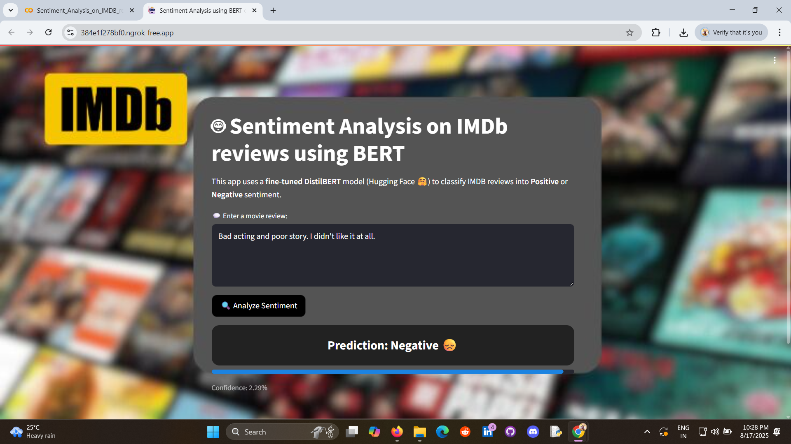
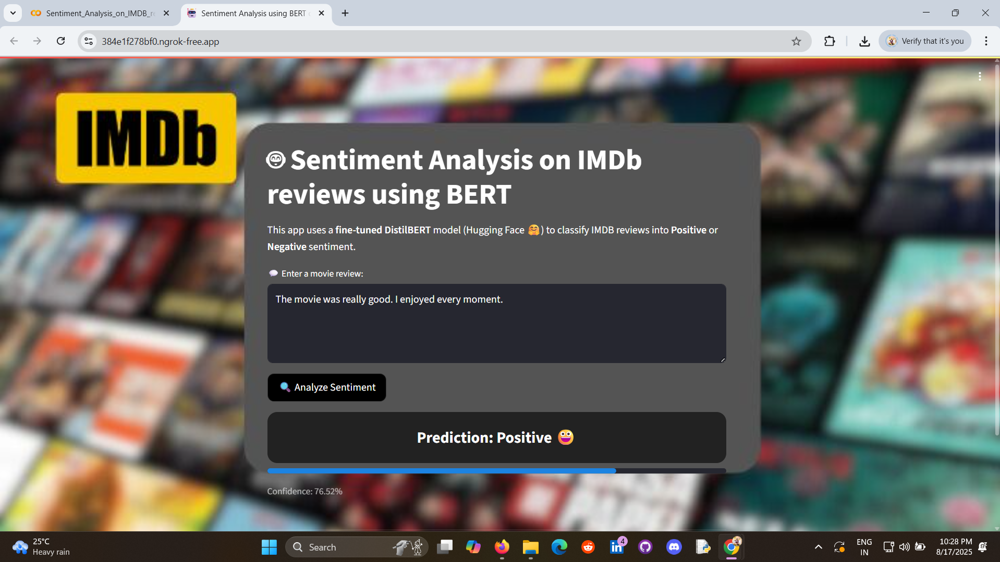

# Sentiment Analysis using BERT on IMDB Reviews

This project implements a **Sentiment Analysis model** using a fine-tuned **DistilBERT** transformer on the **IMDB movie reviews dataset**. The model classifies reviews into **Positive** or **Negative** sentiments.

---

##  Project Overview

* Built a **binary text classification** model using **Hugging Face Transformers** and **PyTorch**.
* Used **DistilBERT** (a smaller, faster version of BERT) for fine-tuning on IMDB reviews.
* Evaluated model performance with **accuracy, loss curves, and classification reports**.
* Deployed the model in an interactive **Streamlit web app** where users can input movie reviews and get real-time sentiment predictions.

---




##  Dataset

* Dataset: **IMDB Movie Reviews** (50,000 labeled reviews).
* Balanced with **25,000 positive** and **25,000 negative** reviews.
* Tokenized using **DistilBERT tokenizer** with truncation and padding.

---

##  Model Workflow

1. **Data Preprocessing**

   * Tokenization with `AutoTokenizer.from_pretrained("distilbert-base-uncased")`
   * Train-test split for evaluation

2. **Model Fine-tuning**

   * Loaded `AutoModelForSequenceClassification` (DistilBERT)
   * Trained for multiple epochs with Adam optimizer & cross-entropy loss

3. **Evaluation**

   * Checked accuracy & loss across epochs
   * Generated classification report & confusion matrix

4. **Deployment**

   * Built a **Streamlit app** (`app.py`)
   * Users enter a review → Model predicts sentiment (Positive / Negative) with confidence

---

##  Installation & Usage

### 1. Clone the repository

```bash
git clone https://github.com/your-username/sentiment-bert-imdb.git
cd sentiment-bert-imdb
```

### 2. Install dependencies

```bash
pip install -r requirements.txt
```

### 3. Run the Streamlit app

```bash
streamlit run app.py
```

---

##  Streamlit App

* Input: Any **movie review text**
* Output:

  * **Prediction**: Positive / Negative
  * **Confidence score**
  * Progress bar visualization

---

##  Results

* Achieved high accuracy (>90%) on IMDB test set
* Model generalizes well to unseen reviews

---

##  Future Work

* Extend to **multiclass sentiment** (e.g., star ratings 1–5)
* Use **larger transformer models** like RoBERTa or BERT-large
* Deploy as a **Hugging Face Space** for easier access

---

##  Tech Stack

* **Python**
* **PyTorch**
* **Hugging Face Transformers**
* **Streamlit**
---
##  Author

👨‍💻 **Sarathkumar Soundarrajan**
📌 LinkedIn: (https://www.linkedin.com/in/sarathkumar271002/))
📌 GitHub: (https://github.com/sarathkumar271002)
